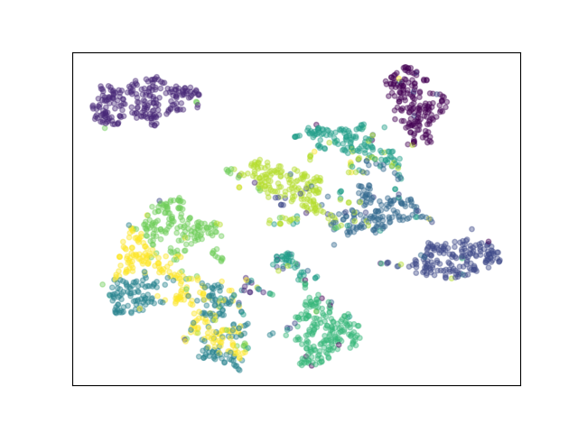

# Restricted-Boltzmann-machine-for-AutoEncoder
Reproduction and Expansion:  Hinton, Geoffrey E., and Ruslan R. Salakhutdinov. "[Reducing the dimensionality of data with neural networks](https://www.science.org/doi/10.1126/science.1127647)." science 313.5786 (2006): 504-507.

Running with default hyperparameters:
```python
python main.py
```
You can use parser to modify hyperparamters, see `parse_option` defined in [utils.py](utils.py) for more details. 


<div align="center">
<h4>Feature Visulization after PCA (784 dimensions -> 30 dimensions)</h4>

<h4>Feature Visulization after Autoencoder (784 dimensions -> 30 dimensions)</h4>

<h4>Feature Visulization after RBM pretrained AutoEncoder (784 dimensions -> 30 dimensions) <p><font color="#dd0000">Best!!!☺👍</font></p> </h4>
 
</div>


Thanks for the wonderful tutorial and framework provided by [ZhangYikaii](https://github.com/ZhangYikaii) in the [wiki](https://github.com/ZhangYikaii/Auxiliary-Material-for-AI-Platform-Application-Course/wiki/%E4%BD%9C%E4%B8%9A-%E8%87%AA%E7%BC%96%E7%A0%81%E5%99%A8-(Autoencoder)).
